# YumCut Characters

YumCut Characters is a project for generating animated character videos from user requests by combining different AI tools across scripting, visuals, voice, and production flow automation, with modular scripts and secure environment-based configuration for reliable integration with YumCut workflows.

[YumCut GitHub](https://github.com/IgorShadurin/app.yumcut.com)
Main open-source app repo: prompt-to-video pipeline for Shorts/Reels/TikTok with scripts, scenes, voiceover, subtitles, and rendering workflows.

[YumCut](https://yumcut.com/?utm_source=yumcut_characters_readme)
Official YumCut website and product landing page for creating viral short-form clips fast.

## Tools

### [lipsync:runware]((scripts/lipsync-runware/README.md))

Runware lip-sync generation from reference video and audio.
Path: `scripts/lipsync-runware/index.ts`

### [lipsync:vmodel]((scripts/lipsync-vmodel/README.md))

VModel talking-photo lip-sync generation from image and audio.
Path: `scripts/lipsync-vmodel/index.ts`

### [character:new]((scripts/character-new/README.md))

Generate or redraw one 9:16 styled character image using Codex subscription image generation.
Path: `scripts/character-new/index.ts`

#### Style Showcase

##### `brainrot-kid`

| 1 | 2 | 3 |
|---|---|---|
| 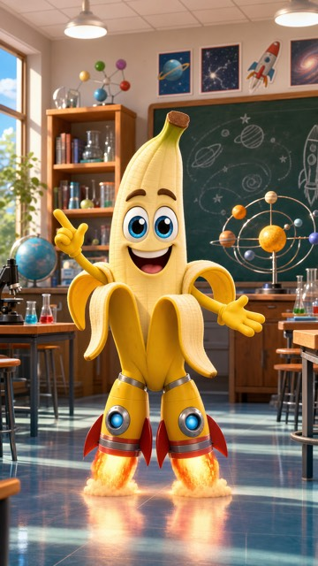 | 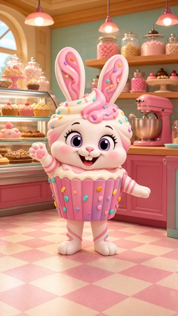 | 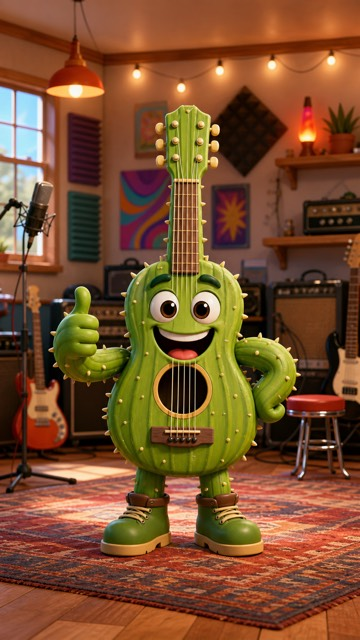 |
| 

Prompt
<code>male character: banana and rocket boots hybrid, full-body in a playful science classroom with chalkboard, planet model, and desks</code>
 | 

Prompt
<code>female character: cupcake and bunny hybrid, full-body in a candy bakery with display case, mixers, and ingredient jars</code>
 | 

Prompt
<code>male character: cactus and guitar hybrid, full-body in a colorful music room with amplifiers, rugs, and wall posters</code>
 |

##### `tropitoon`

| 1 | 2 | 3 |
|---|---|---|
| 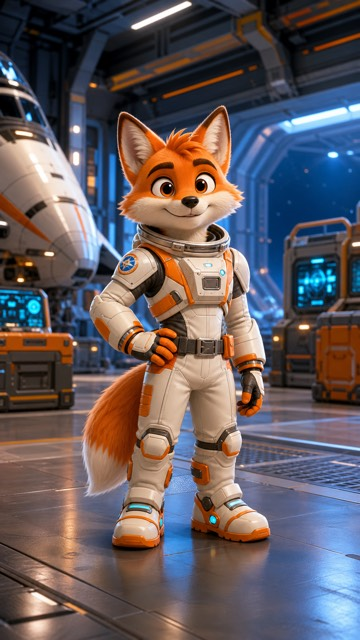 | 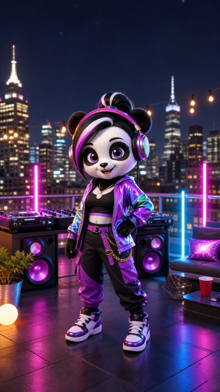 | 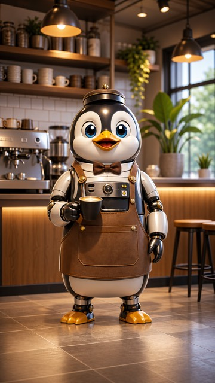 |
| 

Prompt
<code>male character: astronaut fox hybrid, full-body in a futuristic hangar with control panels, cargo crates, and light strips</code>
 | 

Prompt
<code>female character: panda DJ hybrid, full-body on a rooftop party setup with DJ decks, speakers, and neon tubes</code>
 | 

Prompt
<code>male character: robot barista penguin hybrid, full-body in a cozy cafe with counter, shelves, and indoor plants</code>
 |

##### `brainrot-cartoon`

| 1 | 2 | 3 |
|---|---|---|
| 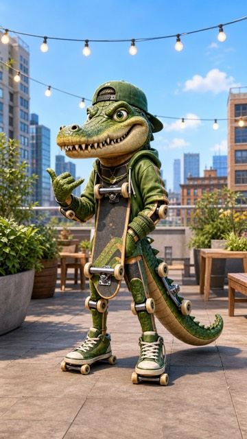 | 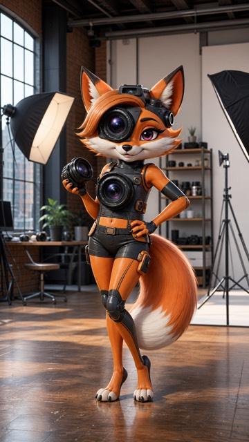 | 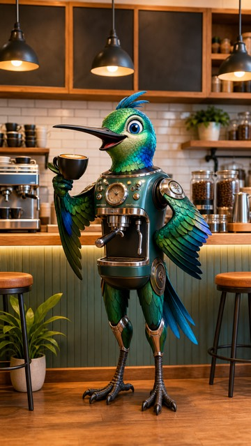 |
| 

Prompt
<code>male character: skateboard and crocodile hybrid, full-body in a rooftop garden with benches, planters, and string lights</code>
 | 

Prompt
<code>female character: camera and fox hybrid, full-body in a city photo studio with softboxes, tripods, and prop shelves</code>
 | 

Prompt
<code>male character: espresso machine and hummingbird hybrid, full-body behind a cafe bar with cups, bean jars, and menu boards</code>
 |

##### `brainrot-adult`

| 1 | 2 | 3 |
|---|---|---|
| 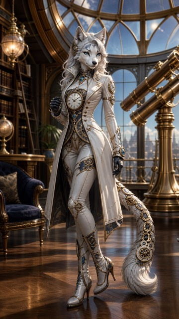 | 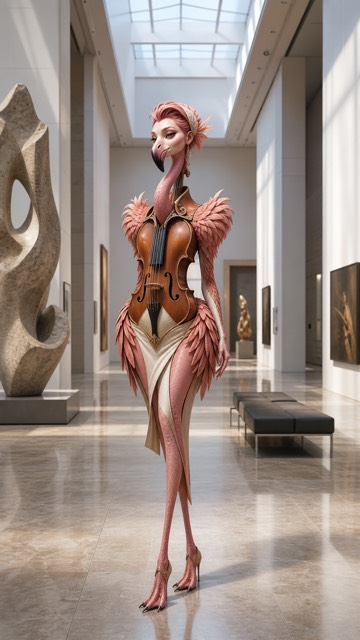 | 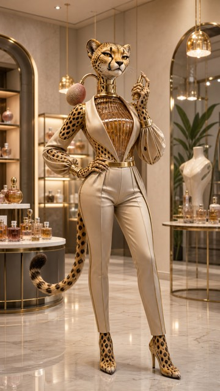 |
| 

Prompt
<code>adult female character: pocket watch and arctic wolf hybrid, full-body in a luxury observatory lounge with brass telescope, bookshelves, and hanging lamps</code>
 | 

Prompt
<code>adult female character: violin and flamingo hybrid, full-body in a modern art museum hall with sculptures, benches, and skylights</code>
 | 

Prompt
<code>adult female character: perfume atomizer and cheetah hybrid, full-body in a high-end boutique interior with display tables, mirrors, and pendant lights</code>
 |

##### `brainrot-cartoon-adult`

| 1 | 2 | 3 |
|---|---|---|
| 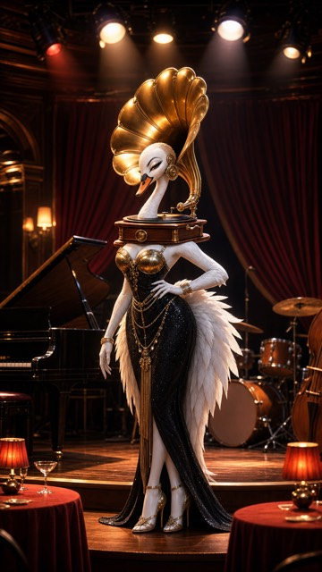 | 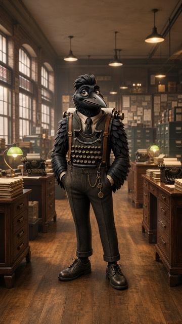 | 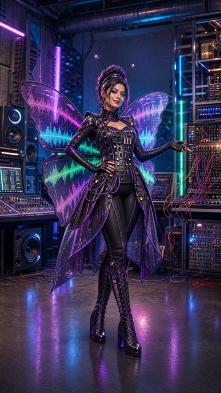 |
| 

Prompt
<code>female character: gramophone and swan hybrid, full-body on a jazz club stage with piano, drum set, and spotlight rig</code>
 | 

Prompt
<code>male character: typewriter and raven hybrid, full-body in a vintage newsroom with desks, desk lamps, and paper stacks</code>
 | 

Prompt
<code>female character: analog synthesizer and butterfly hybrid, full-body in a neon music lab with speakers, rack gear, and LED tubes</code>
 |

##### `brainrot-detailed`

| 1 | 2 | 3 |
|---|---|---|
| 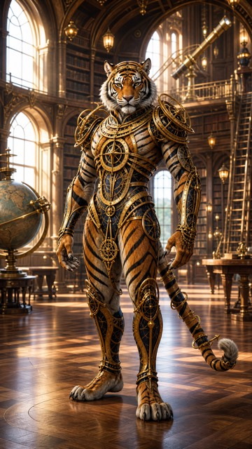 | 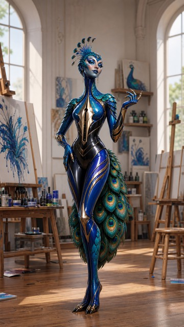 | 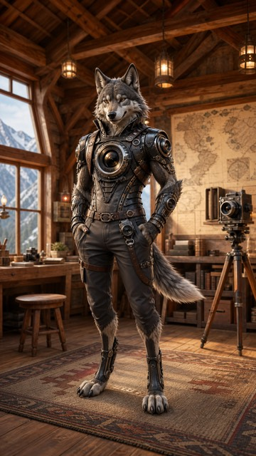 |
| 

Prompt
<code>male character: astrolabe and tiger hybrid, full-body in a library observatory with globe, ladder shelves, and arched windows</code>
 | 

Prompt
<code>female character: fountain pen and peacock hybrid, full-body in an artist atelier with easels, paint jars, and canvases</code>
 | 

Prompt
<code>male character: camera and wolf hybrid, full-body in a mountain lodge studio with wooden beams, lanterns, and map wall</code>
 |

#### Redraw Clones

| Tralalero_Tralala.webp | images.jpeg | Chimpanzini_Bananino.png |
|---|---|---|
| 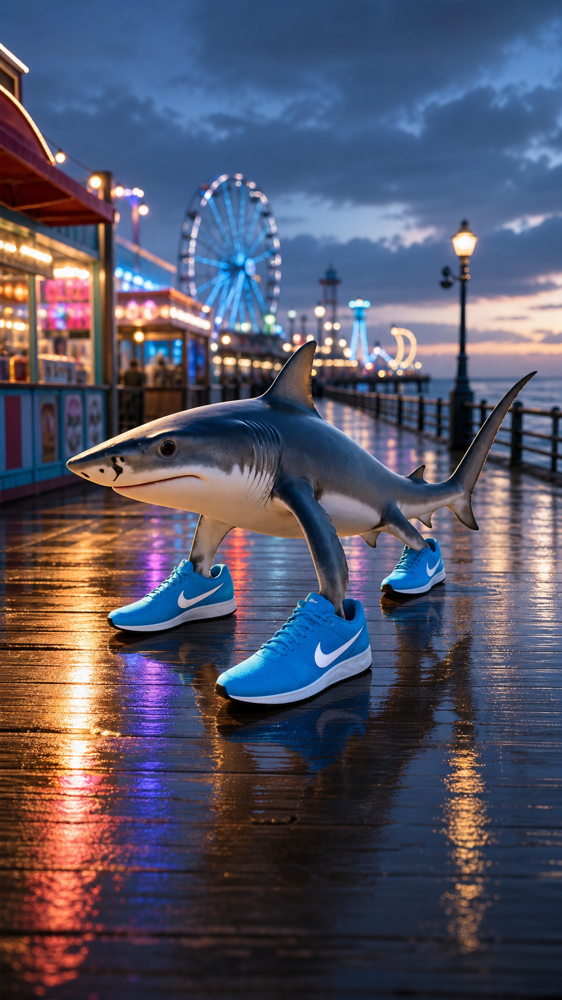 | 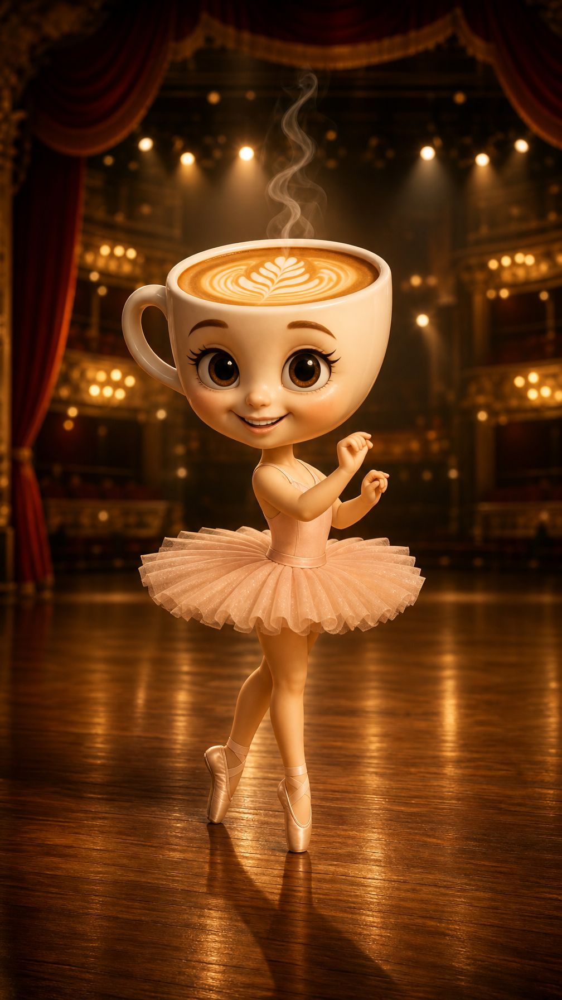 | 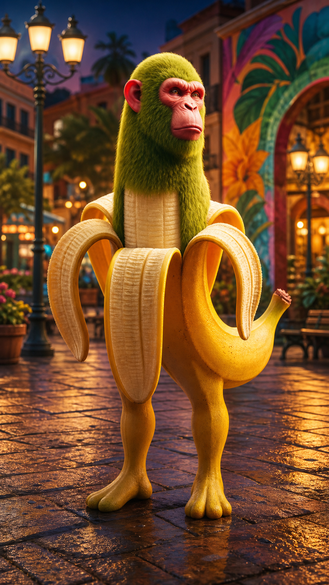 |
| 

Prompt
<code>same character style and identity, full-body centered, cinematic boardwalk at blue hour with neon kiosks, reflections on wet floor, and distant carnival lights</code>
 | 

Prompt
<code>same character style and identity, full-body centered, premium studio stage with rim lights, reflective floor, and soft volumetric haze</code>
 | 

Prompt
<code>same character style and identity, full-body centered, vibrant urban plaza with street murals, decorative lamps, and evening bokeh</code>
 |
