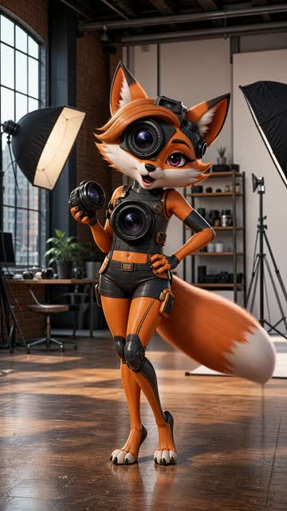
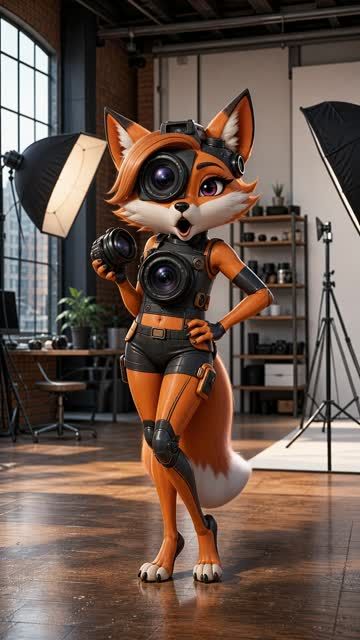
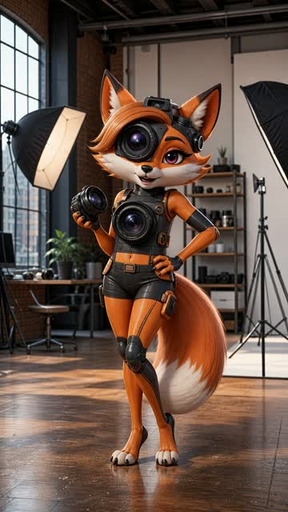
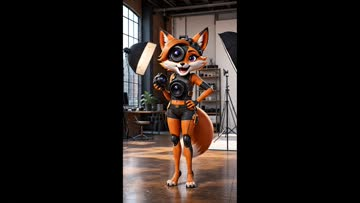
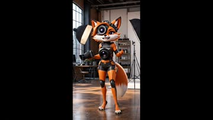
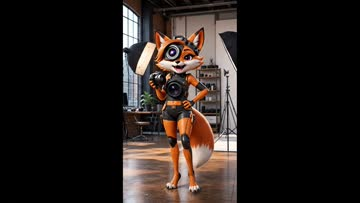
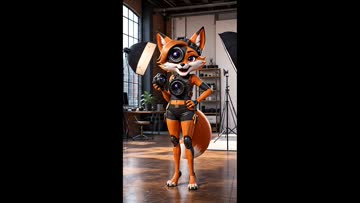
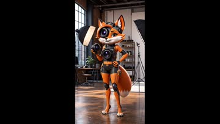
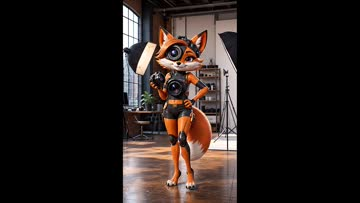

# YumCut Characters

YumCut Characters is a project for generating animated character videos from user requests by combining different AI tools across scripting, visuals, voice, and production flow automation, with modular scripts and secure environment-based configuration for reliable integration with YumCut workflows.

[YumCut GitHub](https://github.com/IgorShadurin/app.yumcut.com)
Main open-source app repo: prompt-to-video pipeline for Shorts/Reels/TikTok with scripts, scenes, voiceover, subtitles, and rendering workflows.

[YumCut](https://yumcut.com/?utm_source=yumcut_characters_readme)
Official YumCut website and product landing page for creating viral short-form clips fast.

## Tools

### [lipsync:runware]((scripts/lipsync-runware/README.md))

Runware lip-sync generation from reference video and audio.
Path: `scripts/lipsync-runware/index.ts`

Example generation (`pixverse:lipsync@1`):

| Happy | Angry | Neutral |
|---|---|---|
|  |  |  |
| 

Info
Model: <code>pixverse:lipsync@1</code> Price: <code>$0.0682</code> Execution time: <code>45.076s</code> Audio: <a href="assets/ai-trauma.wav">ai-trauma.wav</a>  Command: <code>npm run lipsync:runware -- tmp/lipsync-runware/brainrot-cartoon-2-fox-ref.mp4 --audio assets/ai-trauma.wav --model pixverse:lipsync@1 --prompt "Emotion: happy. Gentle warm smile, light upbeat energy, friendly eye expression, subtle positive head movement; keep it natural and controlled." --output assets/lipsync-runware/examples/brainrot-cartoon-2-fox-ai-trauma-happy-pixverse.mp4</code>  Report: <code>assets/lipsync-runware/examples/brainrot-cartoon-2-fox-ai-trauma-happy-pixverse.json</code>
 | 

Info
Model: <code>pixverse:lipsync@1</code> Price: <code>$0.0682</code> Execution time: <code>39.867s</code> Audio: <a href="assets/ai-trauma.wav">ai-trauma.wav</a>  Command: <code>npm run lipsync:runware -- tmp/lipsync-runware/brainrot-cartoon-2-fox-ref.mp4 --audio assets/ai-trauma.wav --model pixverse:lipsync@1 --prompt "Emotion: angry. Firm serious expression, restrained tension in brows and jaw, assertive delivery, minimal aggressive movement; avoid exaggeration." --output assets/lipsync-runware/examples/brainrot-cartoon-2-fox-ai-trauma-angry-pixverse.mp4</code>  Report: <code>assets/lipsync-runware/examples/brainrot-cartoon-2-fox-ai-trauma-angry-pixverse.json</code>
 | 

Info
Model: <code>pixverse:lipsync@1</code> Price: <code>$0.0682</code> Execution time: <code>40.047s</code> Audio: <a href="assets/ai-trauma.wav">ai-trauma.wav</a>  Command: <code>npm run lipsync:runware -- tmp/lipsync-runware/brainrot-cartoon-2-fox-ref.mp4 --audio assets/ai-trauma.wav --model pixverse:lipsync@1 --prompt "Emotion: neutral. Calm balanced expression, steady eye line, minimal facial change, natural conversational cadence; keep performance grounded." --output assets/lipsync-runware/examples/brainrot-cartoon-2-fox-ai-trauma-neutral-pixverse.mp4</code>  Report: <code>assets/lipsync-runware/examples/brainrot-cartoon-2-fox-ai-trauma-neutral-pixverse.json</code>
 |

Example generation (`bytedance:seedance@2.0`):

| Happy | Angry | Neutral |
|---|---|---|
|  |  |  |
| 

Info
Model: <code>bytedance:seedance@2.0</code> Price: <code>$0.79497</code> Execution time: <code>233.583s</code> Audio: <a href="assets/ai-trauma.wav">ai-trauma.wav</a>  Command: <code>npm run lipsync:runware -- --image assets/lipsync-runware/examples/brainrot-cartoon-2-fox-original.png --audio assets/ai-trauma.wav --model bytedance:seedance@2.0 --prompt "Emotion: happy. Gentle warm smile, light upbeat energy, friendly eye expression, subtle positive head movement; keep it natural and controlled." --output assets/lipsync-runware/examples/brainrot-cartoon-2-fox-ai-trauma-happy-seedance2.mp4</code>  Report: <code>assets/lipsync-runware/examples/brainrot-cartoon-2-fox-ai-trauma-happy-seedance2.json</code>
 | 

Info
Model: <code>bytedance:seedance@2.0</code> Price: <code>$0.79497</code> Execution time: <code>158.897s</code> Audio: <a href="assets/ai-trauma.wav">ai-trauma.wav</a>  Command: <code>npm run lipsync:runware -- --image assets/lipsync-runware/examples/brainrot-cartoon-2-fox-original.png --audio assets/ai-trauma.wav --model bytedance:seedance@2.0 --prompt "Emotion: angry. Firm serious expression, restrained tension in brows and jaw, assertive delivery, minimal aggressive movement; avoid exaggeration." --output assets/lipsync-runware/examples/brainrot-cartoon-2-fox-ai-trauma-angry-seedance2.mp4</code>  Report: <code>assets/lipsync-runware/examples/brainrot-cartoon-2-fox-ai-trauma-angry-seedance2.json</code>
 | 

Info
Model: <code>bytedance:seedance@2.0</code> Price: <code>$0.79497</code> Execution time: <code>174.933s</code> Audio: <a href="assets/ai-trauma.wav">ai-trauma.wav</a>  Command: <code>npm run lipsync:runware -- --image assets/lipsync-runware/examples/brainrot-cartoon-2-fox-original.png --audio assets/ai-trauma.wav --model bytedance:seedance@2.0 --prompt "Emotion: neutral. Calm balanced expression, steady eye line, minimal facial change, natural conversational cadence; keep performance grounded." --output assets/lipsync-runware/examples/brainrot-cartoon-2-fox-ai-trauma-neutral-seedance2.mp4</code>  Report: <code>assets/lipsync-runware/examples/brainrot-cartoon-2-fox-ai-trauma-neutral-seedance2.json</code>
 |

Example generation (`bytedance:seedance@2.0-fast`):

| Happy | Angry | Neutral |
|---|---|---|
|  |  |  |
| 

Info
Model: <code>bytedance:seedance@2.0-fast</code> Price: <code>$0.6534</code> Execution time: <code>143.486s</code> Audio: <a href="assets/ai-trauma.wav">ai-trauma.wav</a>  Command: <code>npm run lipsync:runware -- --image assets/lipsync-runware/examples/brainrot-cartoon-2-fox-original.png --audio assets/ai-trauma.wav --model bytedance:seedance@2.0-fast --prompt "Emotion: happy. Gentle warm smile, light upbeat energy, friendly eye expression, subtle positive head movement; keep it natural and controlled." --output assets/lipsync-runware/examples/brainrot-cartoon-2-fox-ai-trauma-happy-seedance2-fast.mp4</code>  Report: <code>assets/lipsync-runware/examples/brainrot-cartoon-2-fox-ai-trauma-happy-seedance2-fast.json</code>
 | 

Info
Model: <code>bytedance:seedance@2.0-fast</code> Price: <code>$0.6534</code> Execution time: <code>127.724s</code> Audio: <a href="assets/ai-trauma.wav">ai-trauma.wav</a>  Command: <code>npm run lipsync:runware -- --image assets/lipsync-runware/examples/brainrot-cartoon-2-fox-original.png --audio assets/ai-trauma.wav --model bytedance:seedance@2.0-fast --prompt "Emotion: angry. Firm serious expression, restrained tension in brows and jaw, assertive delivery, minimal aggressive movement; avoid exaggeration." --output assets/lipsync-runware/examples/brainrot-cartoon-2-fox-ai-trauma-angry-seedance2-fast.mp4</code>  Report: <code>assets/lipsync-runware/examples/brainrot-cartoon-2-fox-ai-trauma-angry-seedance2-fast.json</code>
 | 

Info
Model: <code>bytedance:seedance@2.0-fast</code> Price: <code>$0.6534</code> Execution time: <code>143.425s</code> Audio: <a href="assets/ai-trauma.wav">ai-trauma.wav</a>  Command: <code>npm run lipsync:runware -- --image assets/lipsync-runware/examples/brainrot-cartoon-2-fox-original.png --audio assets/ai-trauma.wav --model bytedance:seedance@2.0-fast --prompt "Emotion: neutral. Calm balanced expression, steady eye line, minimal facial change, natural conversational cadence; keep performance grounded." --output assets/lipsync-runware/examples/brainrot-cartoon-2-fox-ai-trauma-neutral-seedance2-fast.mp4</code>  Report: <code>assets/lipsync-runware/examples/brainrot-cartoon-2-fox-ai-trauma-neutral-seedance2-fast.json</code>
 |

### [lipsync:togetherai]((scripts/lipsync-togetherai/README.md))

Together AI image+audio to video generation across supported models.
Path: `scripts/lipsync-togetherai/index.ts`

Example generation (`Wan-AI/wan2.7-i2v`):

| Happy | Angry | Neutral |
|---|---|---|
|  |  |  |
| 

Info
Model: <code>Wan-AI/wan2.7-i2v</code> Price: <code>null</code> Execution time: <code>140.105s</code> Audio: <a href="assets/ai-trauma.wav">ai-trauma.wav</a>  Command: <code>npm run lipsync:togetherai -- --image assets/lipsync-runware/examples/brainrot-cartoon-2-fox-original.png --audio assets/ai-trauma.wav --model Wan-AI/wan2.7-i2v --prompt "Emotion: happy. Gentle warm smile, light upbeat energy, friendly eye expression, subtle positive head movement; keep it natural and controlled." --output assets/lipsync-togetherai/examples/brainrot-cartoon-2-fox-ai-trauma-happy-wan2.7-i2v.mp4</code>  Report: <code>assets/lipsync-togetherai/examples/brainrot-cartoon-2-fox-ai-trauma-happy-wan2.7-i2v.json</code>
 | 

Info
Model: <code>Wan-AI/wan2.7-i2v</code> Price: <code>null</code> Execution time: <code>188.527s</code> Audio: <a href="assets/ai-trauma.wav">ai-trauma.wav</a>  Command: <code>npm run lipsync:togetherai -- --image assets/lipsync-runware/examples/brainrot-cartoon-2-fox-original.png --audio assets/ai-trauma.wav --model Wan-AI/wan2.7-i2v --prompt "Emotion: angry. Firm serious expression, restrained tension in brows and jaw, assertive delivery, minimal aggressive movement; avoid exaggeration." --output assets/lipsync-togetherai/examples/brainrot-cartoon-2-fox-ai-trauma-angry-wan2.7-i2v.mp4</code>  Report: <code>assets/lipsync-togetherai/examples/brainrot-cartoon-2-fox-ai-trauma-angry-wan2.7-i2v.json</code>
 | 

Info
Model: <code>Wan-AI/wan2.7-i2v</code> Price: <code>null</code> Execution time: <code>172.676s</code> Audio: <a href="assets/ai-trauma.wav">ai-trauma.wav</a>  Command: <code>npm run lipsync:togetherai -- --image assets/lipsync-runware/examples/brainrot-cartoon-2-fox-original.png --audio assets/ai-trauma.wav --model Wan-AI/wan2.7-i2v --prompt "Emotion: neutral. Calm balanced expression, steady eye line, minimal facial change, natural conversational cadence; keep performance grounded." --output assets/lipsync-togetherai/examples/brainrot-cartoon-2-fox-ai-trauma-neutral-wan2.7-i2v.mp4</code>  Report: <code>assets/lipsync-togetherai/examples/brainrot-cartoon-2-fox-ai-trauma-neutral-wan2.7-i2v.json</code>
 |

Example generation (`google/veo-3.0-audio`):

| Happy | Angry | Neutral |
|---|---|---|
|  |  |  |
| 

Info
Model: <code>google/veo-3.0-audio</code> Price: <code>$2.4</code> Execution time: <code>85.752s</code> Audio: <a href="assets/ai-trauma.wav">ai-trauma.wav</a>  Command: <code>npm run lipsync:togetherai -- --image assets/lipsync-runware/examples/brainrot-cartoon-2-fox-original.png --audio assets/ai-trauma.wav --model google/veo-3.0-audio --prompt "Emotion: happy. Gentle warm smile, light upbeat energy, friendly eye expression, subtle positive head movement; keep it natural and controlled." --output assets/lipsync-togetherai/examples/brainrot-cartoon-2-fox-ai-trauma-happy-veo3-audio.mp4</code>  Report: <code>assets/lipsync-togetherai/examples/brainrot-cartoon-2-fox-ai-trauma-happy-veo3-audio.json</code>
 | 

Info
Model: <code>google/veo-3.0-audio</code> Price: <code>$2.4</code> Execution time: <code>88.212s</code> Audio: <a href="assets/ai-trauma.wav">ai-trauma.wav</a>  Command: <code>npm run lipsync:togetherai -- --image assets/lipsync-runware/examples/brainrot-cartoon-2-fox-original.png --audio assets/ai-trauma.wav --model google/veo-3.0-audio --prompt "Emotion: angry. Firm serious expression, restrained tension in brows and jaw, assertive delivery, minimal aggressive movement; avoid exaggeration." --output assets/lipsync-togetherai/examples/brainrot-cartoon-2-fox-ai-trauma-angry-veo3-audio.mp4</code>  Report: <code>assets/lipsync-togetherai/examples/brainrot-cartoon-2-fox-ai-trauma-angry-veo3-audio.json</code>
 | 

Info
Model: <code>google/veo-3.0-audio</code> Price: <code>$2.4</code> Execution time: <code>145.9s</code> Audio: <a href="assets/ai-trauma.wav">ai-trauma.wav</a>  Command: <code>npm run lipsync:togetherai -- --image assets/lipsync-runware/examples/brainrot-cartoon-2-fox-original.png --audio assets/ai-trauma.wav --model google/veo-3.0-audio --prompt "Emotion: neutral. Calm balanced expression, steady eye line, minimal facial change, natural conversational cadence; keep performance grounded." --output assets/lipsync-togetherai/examples/brainrot-cartoon-2-fox-ai-trauma-neutral-veo3-audio.mp4</code>  Report: <code>assets/lipsync-togetherai/examples/brainrot-cartoon-2-fox-ai-trauma-neutral-veo3-audio.json</code>
 |

Example generation (`google/veo-3.0-fast-audio`):

| Happy | Angry | Neutral |
|---|---|---|
|  |  |  |
| 

Info
Model: <code>google/veo-3.0-fast-audio</code> Price: <code>$0.9</code> Execution time: <code>133.737s</code> Audio: <a href="assets/ai-trauma.wav">ai-trauma.wav</a>  Command: <code>npm run lipsync:togetherai -- --image assets/lipsync-runware/examples/brainrot-cartoon-2-fox-original.png --audio assets/ai-trauma.wav --model google/veo-3.0-fast-audio --prompt "Emotion: happy. Gentle warm smile, light upbeat energy, friendly eye expression, subtle positive head movement; keep it natural and controlled." --output assets/lipsync-togetherai/examples/brainrot-cartoon-2-fox-ai-trauma-happy-veo3-fast-audio.mp4</code>  Report: <code>assets/lipsync-togetherai/examples/brainrot-cartoon-2-fox-ai-trauma-happy-veo3-fast-audio.json</code>
 | 

Info
Model: <code>google/veo-3.0-fast-audio</code> Price: <code>$0.9</code> Execution time: <code>133.497s</code> Audio: <a href="assets/ai-trauma.wav">ai-trauma.wav</a>  Command: <code>npm run lipsync:togetherai -- --image assets/lipsync-runware/examples/brainrot-cartoon-2-fox-original.png --audio assets/ai-trauma.wav --model google/veo-3.0-fast-audio --prompt "Emotion: angry. Firm serious expression, restrained tension in brows and jaw, assertive delivery, minimal aggressive movement; avoid exaggeration." --output assets/lipsync-togetherai/examples/brainrot-cartoon-2-fox-ai-trauma-angry-veo3-fast-audio.mp4</code>  Report: <code>assets/lipsync-togetherai/examples/brainrot-cartoon-2-fox-ai-trauma-angry-veo3-fast-audio.json</code>
 | 

Info
Model: <code>google/veo-3.0-fast-audio</code> Price: <code>$0.9</code> Execution time: <code>105.894s</code> Audio: <a href="assets/ai-trauma.wav">ai-trauma.wav</a>  Command: <code>npm run lipsync:togetherai -- --image assets/lipsync-runware/examples/brainrot-cartoon-2-fox-original.png --audio assets/ai-trauma.wav --model google/veo-3.0-fast-audio --prompt "Emotion: neutral. Calm balanced expression, steady eye line, minimal facial change, natural conversational cadence; keep performance grounded." --output assets/lipsync-togetherai/examples/brainrot-cartoon-2-fox-ai-trauma-neutral-veo3-fast-audio.mp4</code>  Report: <code>assets/lipsync-togetherai/examples/brainrot-cartoon-2-fox-ai-trauma-neutral-veo3-fast-audio.json</code>
 |

### [lipsync:vmodel]((scripts/lipsync-vmodel/README.md))

VModel talking-photo lip-sync generation from image and audio.
Path: `scripts/lipsync-vmodel/index.ts`

### [character:new]((scripts/character-new/README.md))

Generate or redraw one 9:16 styled character image using Codex subscription image generation.
Path: `scripts/character-new/index.ts`

#### Style Showcase

##### `brainrot-kid`

| 1 | 2 | 3 |
|---|---|---|
|  |  |  |
| 

Prompt
<code>male character: banana and rocket boots hybrid, full-body in a playful science classroom with chalkboard, planet model, and desks</code>
 | 

Prompt
<code>female character: cupcake and bunny hybrid, full-body in a candy bakery with display case, mixers, and ingredient jars</code>
 | 

Prompt
<code>male character: cactus and guitar hybrid, full-body in a colorful music room with amplifiers, rugs, and wall posters</code>
 |

##### `tropitoon`

| 1 | 2 | 3 |
|---|---|---|
|  |  |  |
| 

Prompt
<code>male character: astronaut fox hybrid, full-body in a futuristic hangar with control panels, cargo crates, and light strips</code>
 | 

Prompt
<code>female character: panda DJ hybrid, full-body on a rooftop party setup with DJ decks, speakers, and neon tubes</code>
 | 

Prompt
<code>male character: robot barista penguin hybrid, full-body in a cozy cafe with counter, shelves, and indoor plants</code>
 |

##### `brainrot-cartoon`

| 1 | 2 | 3 |
|---|---|---|
|  |  |  |
| 

Prompt
<code>male character: skateboard and crocodile hybrid, full-body in a rooftop garden with benches, planters, and string lights</code>
 | 

Prompt
<code>female character: camera and fox hybrid, full-body in a city photo studio with softboxes, tripods, and prop shelves</code>
 | 

Prompt
<code>male character: espresso machine and hummingbird hybrid, full-body behind a cafe bar with cups, bean jars, and menu boards</code>
 |

##### `brainrot-adult`

| 1 | 2 | 3 |
|---|---|---|
|  |  |  |
| 

Prompt
<code>adult female character: pocket watch and arctic wolf hybrid, full-body in a luxury observatory lounge with brass telescope, bookshelves, and hanging lamps</code>
 | 

Prompt
<code>adult female character: violin and flamingo hybrid, full-body in a modern art museum hall with sculptures, benches, and skylights</code>
 | 

Prompt
<code>adult female character: perfume atomizer and cheetah hybrid, full-body in a high-end boutique interior with display tables, mirrors, and pendant lights</code>
 |

##### `brainrot-cartoon-adult`

| 1 | 2 | 3 |
|---|---|---|
|  |  |  |
| 

Prompt
<code>female character: gramophone and swan hybrid, full-body on a jazz club stage with piano, drum set, and spotlight rig</code>
 | 

Prompt
<code>male character: typewriter and raven hybrid, full-body in a vintage newsroom with desks, desk lamps, and paper stacks</code>
 | 

Prompt
<code>female character: analog synthesizer and butterfly hybrid, full-body in a neon music lab with speakers, rack gear, and LED tubes</code>
 |

##### `brainrot-detailed`

| 1 | 2 | 3 |
|---|---|---|
|  |  |  |
| 

Prompt
<code>male character: astrolabe and tiger hybrid, full-body in a library observatory with globe, ladder shelves, and arched windows</code>
 | 

Prompt
<code>female character: fountain pen and peacock hybrid, full-body in an artist atelier with easels, paint jars, and canvases</code>
 | 

Prompt
<code>male character: camera and wolf hybrid, full-body in a mountain lodge studio with wooden beams, lanterns, and map wall</code>
 |

#### Redraw Clones

| Source A | Source B | Source C |
|---|---|---|
|  |  |  |
| 

Prompt
<code>same character style and identity, full-body centered, cinematic boardwalk at blue hour with neon kiosks, reflections on wet floor, and distant carnival lights</code>
 | 

Prompt
<code>same character style and identity, full-body centered, premium studio stage with rim lights, reflective floor, and soft volumetric haze</code>
 | 

Prompt
<code>same character style and identity, full-body centered, vibrant urban plaza with street murals, decorative lamps, and evening bokeh</code>
 |
