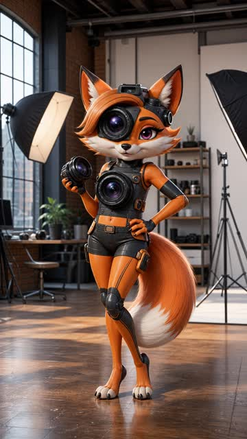
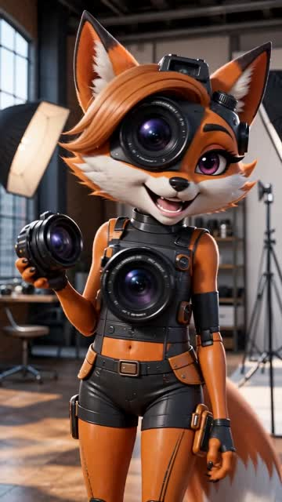
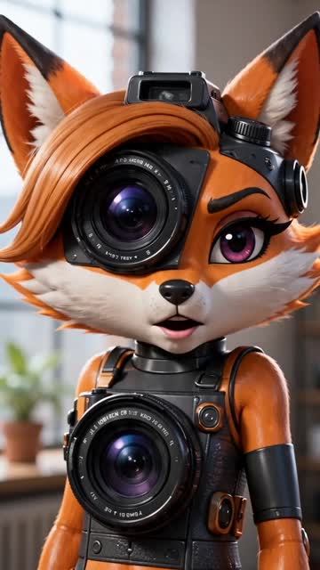
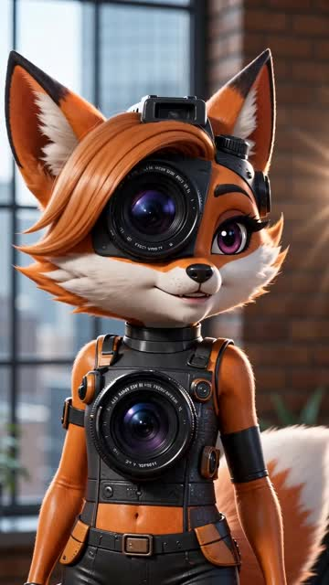
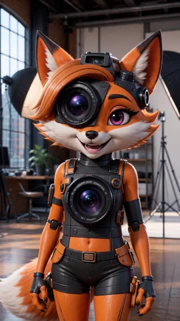
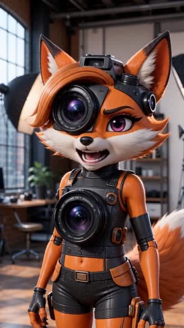
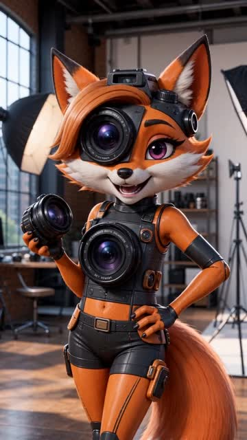
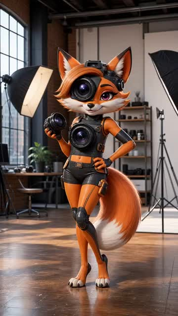
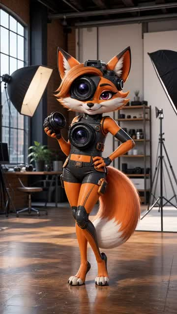

# lipsync:runware

Create a lip-synced video with Runware from a reference video and an audio file.

Supported hardcoded models:
- `pixverse:lipsync@1`
- `klingai:7@1`
- `bytedance:seedance@2.0`
- `bytedance:seedance@2.0-fast`
- `prunaai:p-video@0`

## Example

```bash
npm run lipsync:runware -- /path/to/reference-video.mp4 --audio /path/to/audio.wav --model pixverse:lipsync@1
```

Seedance image + audio example:

```bash
npm run lipsync:runware -- --image /path/to/reference-image.png --audio /path/to/audio.wav --model bytedance:seedance@2.0
```

## Full Params

```bash
npm run lipsync:runware -- \
  --video /path/to/reference-video.mp4 \
  --audio /path/to/audio.wav \
  --output /path/to/output.mp4 \
  --model klingai:7@1 \
  --prompt "Emotion: neutral, calm and controlled performance" \
  --prompt-file /path/to/performance-default.md \
  --include-cost=true \
  --include-report=true \
  --poll-interval-ms=5000 \
  --timeout-ms=600000
```

## Model Notes

- `--model` default: `prunaai:p-video@0`.
- Supported hardcoded models:
  - `pixverse:lipsync@1`
  - `klingai:7@1`
  - `bytedance:seedance@2.0`
  - `bytedance:seedance@2.0-fast`
  - `prunaai:p-video@0`
- Model request mapping:
  - `pixverse:lipsync@1` -> `referenceVideos` + `inputAudios`
  - `klingai:7@1` -> `inputs.video` + `inputs.audio`
  - `bytedance:seedance@2.0` / `bytedance:seedance@2.0-fast` -> `inputs.referenceImages` + `inputs.referenceAudios` + `settings.audio=true`
  - `prunaai:p-video@0` -> `inputs.frameImages` + `inputs.audio` + `settings.audio=true`
- `klingai:7@1` does not extend output duration to full audio length; it keeps the input video timing window.
- `klingai:7@1` output quality/motion is usually less smooth than `pixverse:lipsync@1` (still usable for many cases).

## Notes

- Requires `RUNWARE_API_KEY` in `.env`.
- Default prompt template path: `scripts/lipsync-runware/prompts/performance-default.md`.
- Add per-run direction (for example emotion): `--prompt "Emotion: happy..."`.
- By default, creates a sidecar JSON report with task info, generation price (if available), and execution time.
- Sidecar path format: `tmp/lipsync-runware/video-3-lipsync.json`.
- Disable cost field request: `--no-cost`.
- Disable JSON report creation: `--no-report`.

## Example Generation (PixVerse)

| Happy | Angry | Neutral |
|---|---|---|
| [](../../assets/lipsync-runware/examples/brainrot-cartoon-2-fox-ai-trauma-happy-pixverse.mp4) | [](../../assets/lipsync-runware/examples/brainrot-cartoon-2-fox-ai-trauma-angry-pixverse.mp4) | [](../../assets/lipsync-runware/examples/brainrot-cartoon-2-fox-ai-trauma-neutral-pixverse.mp4) |

<details>
<summary>Happy Info (pixverse:lipsync@1)</summary>

Price: `$0.0682`  
Execution time: `45.076s`  
Audio: [ai-trauma.wav](../../assets/ai-trauma.wav)

```bash
npm run lipsync:runware -- \
  tmp/lipsync-runware/brainrot-cartoon-2-fox-ref.mp4 \
  --audio assets/ai-trauma.wav \
  --model pixverse:lipsync@1 \
  --prompt "Emotion: happy. Gentle warm smile, light upbeat energy, friendly eye expression, subtle positive head movement; keep it natural and controlled." \
  --output assets/lipsync-runware/examples/brainrot-cartoon-2-fox-ai-trauma-happy-pixverse.mp4
```

Report: `assets/lipsync-runware/examples/brainrot-cartoon-2-fox-ai-trauma-happy-pixverse.json`

</details>

<details>
<summary>Angry Info (pixverse:lipsync@1)</summary>

Price: `$0.0682`  
Execution time: `39.867s`  
Audio: [ai-trauma.wav](../../assets/ai-trauma.wav)

```bash
npm run lipsync:runware -- \
  tmp/lipsync-runware/brainrot-cartoon-2-fox-ref.mp4 \
  --audio assets/ai-trauma.wav \
  --model pixverse:lipsync@1 \
  --prompt "Emotion: angry. Firm serious expression, restrained tension in brows and jaw, assertive delivery, minimal aggressive movement; avoid exaggeration." \
  --output assets/lipsync-runware/examples/brainrot-cartoon-2-fox-ai-trauma-angry-pixverse.mp4
```

Report: `assets/lipsync-runware/examples/brainrot-cartoon-2-fox-ai-trauma-angry-pixverse.json`

</details>

<details>
<summary>Neutral Info (pixverse:lipsync@1)</summary>

Price: `$0.0682`  
Execution time: `40.047s`  
Audio: [ai-trauma.wav](../../assets/ai-trauma.wav)

```bash
npm run lipsync:runware -- \
  tmp/lipsync-runware/brainrot-cartoon-2-fox-ref.mp4 \
  --audio assets/ai-trauma.wav \
  --model pixverse:lipsync@1 \
  --prompt "Emotion: neutral. Calm balanced expression, steady eye line, minimal facial change, natural conversational cadence; keep performance grounded." \
  --output assets/lipsync-runware/examples/brainrot-cartoon-2-fox-ai-trauma-neutral-pixverse.mp4
```

Report: `assets/lipsync-runware/examples/brainrot-cartoon-2-fox-ai-trauma-neutral-pixverse.json`

</details>

## Example Generation (Seedance 2.0)

| Happy | Angry | Neutral |
|---|---|---|
| [](../../assets/lipsync-runware/examples/brainrot-cartoon-2-fox-ai-trauma-happy-seedance2.mp4) | [](../../assets/lipsync-runware/examples/brainrot-cartoon-2-fox-ai-trauma-angry-seedance2.mp4) | [](../../assets/lipsync-runware/examples/brainrot-cartoon-2-fox-ai-trauma-neutral-seedance2.mp4) |

<details>
<summary>Happy Info (bytedance:seedance@2.0)</summary>

Price: `$0.79497`  
Execution time: `233.583s`  
Audio: [ai-trauma.wav](../../assets/ai-trauma.wav)

```bash
npm run lipsync:runware -- \
  --image assets/lipsync-runware/examples/brainrot-cartoon-2-fox-original.png \
  --audio assets/ai-trauma.wav \
  --model bytedance:seedance@2.0 \
  --prompt "Emotion: happy. Gentle warm smile, light upbeat energy, friendly eye expression, subtle positive head movement; keep it natural and controlled." \
  --output assets/lipsync-runware/examples/brainrot-cartoon-2-fox-ai-trauma-happy-seedance2.mp4
```

Report: `assets/lipsync-runware/examples/brainrot-cartoon-2-fox-ai-trauma-happy-seedance2.json`

</details>

<details>
<summary>Angry Info (bytedance:seedance@2.0)</summary>

Price: `$0.79497`  
Execution time: `158.897s`  
Audio: [ai-trauma.wav](../../assets/ai-trauma.wav)

```bash
npm run lipsync:runware -- \
  --image assets/lipsync-runware/examples/brainrot-cartoon-2-fox-original.png \
  --audio assets/ai-trauma.wav \
  --model bytedance:seedance@2.0 \
  --prompt "Emotion: angry. Firm serious expression, restrained tension in brows and jaw, assertive delivery, minimal aggressive movement; avoid exaggeration." \
  --output assets/lipsync-runware/examples/brainrot-cartoon-2-fox-ai-trauma-angry-seedance2.mp4
```

Report: `assets/lipsync-runware/examples/brainrot-cartoon-2-fox-ai-trauma-angry-seedance2.json`

</details>

<details>
<summary>Neutral Info (bytedance:seedance@2.0)</summary>

Price: `$0.79497`  
Execution time: `174.933s`  
Audio: [ai-trauma.wav](../../assets/ai-trauma.wav)

```bash
npm run lipsync:runware -- \
  --image assets/lipsync-runware/examples/brainrot-cartoon-2-fox-original.png \
  --audio assets/ai-trauma.wav \
  --model bytedance:seedance@2.0 \
  --prompt "Emotion: neutral. Calm balanced expression, steady eye line, minimal facial change, natural conversational cadence; keep performance grounded." \
  --output assets/lipsync-runware/examples/brainrot-cartoon-2-fox-ai-trauma-neutral-seedance2.mp4
```

Report: `assets/lipsync-runware/examples/brainrot-cartoon-2-fox-ai-trauma-neutral-seedance2.json`

</details>

## Example Generation (Seedance 2.0 Fast)

| Happy | Angry | Neutral |
|---|---|---|
| [](../../assets/lipsync-runware/examples/brainrot-cartoon-2-fox-ai-trauma-happy-seedance2-fast.mp4) | [](../../assets/lipsync-runware/examples/brainrot-cartoon-2-fox-ai-trauma-angry-seedance2-fast.mp4) | [](../../assets/lipsync-runware/examples/brainrot-cartoon-2-fox-ai-trauma-neutral-seedance2-fast.mp4) |

<details>
<summary>Happy Info (bytedance:seedance@2.0-fast)</summary>

Price: `$0.6534`  
Execution time: `143.486s`  
Audio: [ai-trauma.wav](../../assets/ai-trauma.wav)

```bash
npm run lipsync:runware -- \
  --image assets/lipsync-runware/examples/brainrot-cartoon-2-fox-original.png \
  --audio assets/ai-trauma.wav \
  --model bytedance:seedance@2.0-fast \
  --prompt "Emotion: happy. Gentle warm smile, light upbeat energy, friendly eye expression, subtle positive head movement; keep it natural and controlled." \
  --output assets/lipsync-runware/examples/brainrot-cartoon-2-fox-ai-trauma-happy-seedance2-fast.mp4
```

Report: `assets/lipsync-runware/examples/brainrot-cartoon-2-fox-ai-trauma-happy-seedance2-fast.json`

</details>

<details>
<summary>Angry Info (bytedance:seedance@2.0-fast)</summary>

Price: `$0.6534`  
Execution time: `127.724s`  
Audio: [ai-trauma.wav](../../assets/ai-trauma.wav)

```bash
npm run lipsync:runware -- \
  --image assets/lipsync-runware/examples/brainrot-cartoon-2-fox-original.png \
  --audio assets/ai-trauma.wav \
  --model bytedance:seedance@2.0-fast \
  --prompt "Emotion: angry. Firm serious expression, restrained tension in brows and jaw, assertive delivery, minimal aggressive movement; avoid exaggeration." \
  --output assets/lipsync-runware/examples/brainrot-cartoon-2-fox-ai-trauma-angry-seedance2-fast.mp4
```

Report: `assets/lipsync-runware/examples/brainrot-cartoon-2-fox-ai-trauma-angry-seedance2-fast.json`

</details>

<details>
<summary>Neutral Info (bytedance:seedance@2.0-fast)</summary>

Price: `$0.6534`  
Execution time: `143.425s`  
Audio: [ai-trauma.wav](../../assets/ai-trauma.wav)

```bash
npm run lipsync:runware -- \
  --image assets/lipsync-runware/examples/brainrot-cartoon-2-fox-original.png \
  --audio assets/ai-trauma.wav \
  --model bytedance:seedance@2.0-fast \
  --prompt "Emotion: neutral. Calm balanced expression, steady eye line, minimal facial change, natural conversational cadence; keep performance grounded." \
  --output assets/lipsync-runware/examples/brainrot-cartoon-2-fox-ai-trauma-neutral-seedance2-fast.mp4
```

Report: `assets/lipsync-runware/examples/brainrot-cartoon-2-fox-ai-trauma-neutral-seedance2-fast.json`

</details>

## Example Generation (P-Video)

| Happy | Angry | Neutral |
|---|---|---|
| [](../../assets/lipsync-runware/examples/brainrot-cartoon-2-fox-ai-trauma-happy-pvideo.mp4) | [](../../assets/lipsync-runware/examples/brainrot-cartoon-2-fox-ai-trauma-angry-pvideo.mp4) | [](../../assets/lipsync-runware/examples/brainrot-cartoon-2-fox-ai-trauma-neutral-pvideo.mp4) |

<details>
<summary>Happy Info (prunaai:p-video@0)</summary>

Price: `$0.1163`  
Execution time: `52.248s`  
Audio: [ai-trauma.wav](../../assets/ai-trauma.wav)

```bash
npm run lipsync:runware -- \
  --image assets/lipsync-runware/examples/brainrot-cartoon-2-fox-original.png \
  --audio assets/ai-trauma.wav \
  --model prunaai:p-video@0 \
  --prompt "Emotion: happy. Gentle warm smile, light upbeat energy, friendly eye expression, subtle positive head movement; keep it natural and controlled." \
  --output assets/lipsync-runware/examples/brainrot-cartoon-2-fox-ai-trauma-happy-pvideo.mp4
```

Report: `assets/lipsync-runware/examples/brainrot-cartoon-2-fox-ai-trauma-happy-pvideo.json`

</details>

<details>
<summary>Angry Info (prunaai:p-video@0)</summary>

Price: `$0.1163`  
Execution time: `35.401s`  
Audio: [ai-trauma.wav](../../assets/ai-trauma.wav)

```bash
npm run lipsync:runware -- \
  --image assets/lipsync-runware/examples/brainrot-cartoon-2-fox-original.png \
  --audio assets/ai-trauma.wav \
  --model prunaai:p-video@0 \
  --prompt "Emotion: angry. Firm serious expression, restrained tension in brows and jaw, assertive delivery, minimal aggressive movement; avoid exaggeration." \
  --output assets/lipsync-runware/examples/brainrot-cartoon-2-fox-ai-trauma-angry-pvideo.mp4
```

Report: `assets/lipsync-runware/examples/brainrot-cartoon-2-fox-ai-trauma-angry-pvideo.json`

</details>

<details>
<summary>Neutral Info (prunaai:p-video@0)</summary>

Price: `$0.1163`  
Execution time: `40.662s`  
Audio: [ai-trauma.wav](../../assets/ai-trauma.wav)

```bash
npm run lipsync:runware -- \
  --image assets/lipsync-runware/examples/brainrot-cartoon-2-fox-original.png \
  --audio assets/ai-trauma.wav \
  --model prunaai:p-video@0 \
  --prompt "Emotion: neutral. Calm balanced expression, steady eye line, minimal facial change, natural conversational cadence; keep performance grounded." \
  --output assets/lipsync-runware/examples/brainrot-cartoon-2-fox-ai-trauma-neutral-pvideo.mp4
```

Report: `assets/lipsync-runware/examples/brainrot-cartoon-2-fox-ai-trauma-neutral-pvideo.json`

</details>

## Pricing Comparison (30s / 60s)

| Model | Model ID | Pricing Basis | 30s | 60s |
|---|---|---:|---:|---:|
| [KlingAI Lip-Sync](https://runware.ai/models/klingai-lip-sync) | [`klingai:7@1`](https://runware.ai/docs/models/klingai-lip-sync) | tiered: $0.0462 (1-5s), $0.0924 (6-10s), then +$0.0092/sec | $0.2764 | $0.5524 |
| [PixVerse LipSync](https://runware.ai/models/pixverse-lipsync) | [`pixverse:lipsync@1`](https://runware.ai/docs/models/pixverse-lipsync) | $0.0136/sec | $0.4080 | $0.8160 |
| [P-Video-Avatar (720p)](https://runware.ai/models/prunaai-p-video-avatar) | [`prunaai:p-video@avatar`](https://runware.ai/models/prunaai-p-video-avatar) | $0.0250/sec (1s shown) | $0.7500 | $1.5000 |
| [lipsync-2](https://runware.ai/models/sync-lipsync-2) | [`sync:lipsync-2@1`](https://runware.ai/docs/models/sync-lipsync-2) | $0.0440/sec | $1.3200 | $2.6400 |
| [KlingAI Avatar 2.0 Standard](https://runware.ai/models/klingai-avatar-2-0-standard) | [Kling Avatar Standard page](https://runware.ai/models/klingai-avatar-2-0-standard) | $0.0440/sec | $1.3200 | $2.6400 |
| [P-Video-Avatar (1080p)](https://runware.ai/models/prunaai-p-video-avatar) | [`prunaai:p-video@avatar`](https://runware.ai/models/prunaai-p-video-avatar) | $0.0450/sec (1s shown) | $1.3500 | $2.7000 |
| [lipsync-2-pro](https://runware.ai/models/sync-lipsync-2-pro) | [`sync:lipsync-2-pro@1`](https://runware.ai/docs/en/providers/sync) | $0.0733/sec | $2.1990 | $4.3980 |
| [KlingAI Avatar 2.0 Pro](https://runware.ai/models/klingai-avatar-2-0-pro) | [`klingai:avatar@2.0-pro`](https://runware.ai/docs/models/klingai-avatar-2-0-pro) | $0.0870/sec | $2.6100 | $5.2200 |
| [sync-3](https://runware.ai/models/sync-3) | [`sync:3@0`](https://runware.ai/models/sync-3) | $0.1330/sec | $3.9900 | $7.9800 |
| [react-1 (includes lip-sync region)](https://runware.ai/models/sync-react-1) | [`sync:react-1@1`](https://runware.ai/docs/models/sync-react-1) | $0.1467/sec | $4.4010 | $8.8020 |

## Photo + Audio Avatar Models

Models below are focused on generating talking video from a reference photo/image and audio, sorted by lower estimated 30s cost first.

| Model | AIR ID | Photo + Audio Fit | 30s (est.) | 60s (est.) | Duration Notes |
|---|---|---|---:|---:|---|
| [P-Video](https://runware.ai/models/prunaai-p-video) | `prunaai:p-video@0` | Image-to-video with audio input support | $0.60 | $1.20 | Docs: `inputs.frameImages` + `inputs.audio`; when audio is provided, clip follows audio-driven flow. |
| [Seedance 1.5 Pro](https://runware.ai/models/bytedance-seedance-1-5-pro) | `bytedance:seedance@1.5-pro` | Native synchronized audio video from image/text | $0.72 | $1.44 | Pricing shown at `480p · 5s · audio = $0.12`; short-form clip workflow. |
| [Aurora v1 Fast](https://runware.ai/models/creatify-aurora-v1-fast) | `creatify:aurora@fast` | Talking-head from single image + audio | $2.10 | $4.20 | Price shown as `480p · 1s = $0.07`; explicit max duration not shown in fetched docs snippets. |
| [OmniHuman-1](https://runware.ai/models/bytedance-omnihuman-1) | `bytedance:5@1` | Talking human video from single image + audio | $2.904 | $5.808 | Provider docs: audio input max 30s (15s recommended). |
| [HeyGen Avatar IV](https://runware.ai/models/heygen-avatar-iv) | `heygen:avatar@4` | Talking avatar from single photo + script/audio | $3.00 | $6.00 | Price shown as `1s = $0.10`; explicit max duration not shown in fetched docs snippets. |
| [OmniHuman-1.5](https://runware.ai/models/bytedance-omnihuman-1-5) | `bytedance:5@2` | Avatar video from single image + audio (+ optional text) | $3.9741 | $7.9482 | Provider docs: audio input max 30s (15s recommended). |
| [Aurora v1](https://runware.ai/models/creatify-aurora-v1) | `creatify:aurora@0` | Talking-head from single image + audio | $4.20 | $8.40 | Price shown as `720p · 1s = $0.14`; explicit max duration not shown in fetched docs snippets. |
